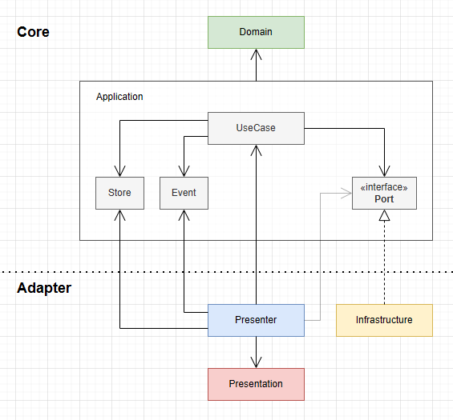

# Unity Fundamental Client 設計指南

## 🎯 指南定位

- **適用範圍：** 本指南專為 **功能相對單純的輕量級專案** 設計。
- **未來規劃：** 針對更複雜、多功能模組的應用，將有另一份進階指南（撰寫中）。

## 🚀 設計目標

### 1. 讓開發更順暢

- **好維護、好上手：** 結構要夠清楚，讓自己或接手的人一看就懂，馬上知道去哪裡改 code、加功能。
- **源自成熟的架構：** 概念基本上是 **Clean Architecture** 和 **Hexagonal Architecture** 的前端實踐版。
- **看資料夾就懂專案在幹嘛：** 導入 **Screaming Architecture** 的精神，讓目錄結構/檔案命名自己會說話，找東西自然就快。

### 2. 把 AI 當作好隊友

- **給 AI 一個清晰的規則：** 現在的 AI 還不太會做架構設計，所以我們先把規則訂好，讓它有軌道可循。我們需要的是一個懂規矩的夥伴，這樣合作起來才有效率。
- **讓 AI 做它擅長的事：** 不要讓 AI 自由發揮搞設計，而是讓它在我們定義好的框架裡幫忙「填空」，比如寫寫具體的功能或重複的程式碼。

### 3. 關於「成本」的思考
有人也許會質疑，這樣的架構是否增加了不必要的寫作成本？就我個人的經驗而言，清晰的框架反而減少了我在實作時的猶豫，讓我能更專注於功能本身。最終，我的整體開發速度是提升的。

## 🛠️ 技術棧
| 函式庫          | 類別                | 用途與選擇理由                                                              |
| :-------------- | :------------------ | :-------------------------------------------------------------------------- |
| **VContainer**  | 依賴注入 (DI)       | 輕量且高效的 DI 容器，是實現模組化與可測試性的基石。                        |
| **UniTask**     | 非同步處理          | 提供現代化的 `async/await` 語法，取代協程，讓非同步流程更具可讀性與確定性。 |
| **R3**          | 響應式編程 (Rx)     | 新一代響應式函式庫，專為建立資料流、處理複雜事件與同步 UI 狀態而設計。      |
| **MessagePipe** | 發布/訂閱 (Pub/Sub) | 高效能的記憶體中事件匯流排，提供跨模組的完全解耦通訊。                      |

## 📂 專案結構
推薦採用以下專案結構，以確保模組的物理隔離與邏輯清晰。

```
Runtime/
├── Domain/                 # 領域模組 (核心業務規則與模型)
├── Application/            # 應用模組 (應用層邏輯)
│   ├── UseCases/           # - 用例 (封裝業務流程)
│   ├── Events/             # - 事件 (跨模組通知)
│   ├── Ports/              # - 接口 (與外部通訊的契約)
│   └── Stores/             # - 狀態倉儲 (應用狀態管理)
├── Infrastructures/        # 基礎建設模組 (外部服務實現)
├── Presentation/           # 表現模組 (UI 元件)
├── Presenters/             # 橋接模組 (Binder)
└── Contexts/               # 依賴注入模組 (DI 容器配置)
```

## 🏗️ 架構概述



此架構遵循**清晰分層**與**關注點分離**的原則，劃分為兩個主要層級：

- **核心 (Core)**：包含 `Domain` 與 `Application` 模組。此層封裝了所有業務規則、應用流程與狀態，完全獨立於 Unity 引擎與外部框架。
- **適配器 (Adapter)**：包含 `Infrastructure`、`Presentation` 與 `Presenter` 模組。此層負責連接核心與外部世界，例如 UI、資料庫、網路服務等。

核心設計準則：
1.  **單向依賴原則**：所有依賴關係都必須指向更穩定、更核心的模組 (例如：`Presenter` → `Application` → `Domain`)。
2.  **關注點分離**：每一層只負責自己的核心職責，確保邊界清晰，防止邏輯洩漏。
3.  **可測試性**：`Domain` 與 `Application` 可單獨測試 。

## 📚 模組介紹

### Domain
**依賴**：無

此模組是業務邏輯的核心，不含任何外部依賴。常見的兩種模式：

1.  **獨立領域模型 (Standalone Domain)**：
    - 適用於具備完整本地遊戲邏輯的場景（如：井字遊戲、回合制戰鬥規則）。
    - 遵循物件導向設計與 CQS (Command Query Separation) 原則，僅承載最純粹的業務規則與狀態變更。

2.  **客戶端業務模型 (Client-Side Business Model)**：
    - 在純客戶端應用中，此模組定義了核心業務模型。這些模型是從伺服器傳來的**原始數據 (DTO)** 在客戶端的**業務體現**。
    - 它們不僅包含數據，更重要的是**封裝了與該數據相關的業務規則、狀態變更邏輯與行為**。這讓 `Application` 可以基於一個更可靠、更富含意義的模型進行操作，而不是直接操作原始的、缺乏行為的 DTO。

### Application
**依賴**：`Domain`

封裝應用程式的特定流程與規則，是調度 `Domain` 模型以完成特定任務的中樞。

- **UseCase**：代表一個完整的用戶場景或業務流程。它負責協調 `Domain` 物件、更新 `Store`、發布 `Event`，並透過 `Port` 與外部服務互動。
- **Store**：應用程式狀態的**單一事實來源 (Single Source of Truth, SSoT)**。`UseCase` 是唯一的寫入方，狀態以響應式 (Reactive) 資料流的形式向外唯讀暴露。`internal` 關鍵字可有效保護寫入權限。
- **Event**：核心層向外廣播重要狀態變更的機制。
- **Port (Interface)**：定義與外部服務（如網路、存檔）的互動契約。`UseCase` 僅依賴此抽象介面，而非具體實現。

### Infrastructure
**依賴**：`Application` (實現其 `Port`)

`Port` 介面的具體實現。此模組封裝了所有與外部系統互動的細節，例如網路請求、本地資料庫讀寫、第三方 SDK 整合等。`Infrastructure` 的具體實現可以隨時替換（如從 REST API 切換到 WebSocket）而無需修改核心程式碼。

### Presentation
**依賴**：無

包含所有 Unity `MonoBehaviour` 相關的視圖元件。此模組嚴格遵循**被動視圖 (Passive View)** 模式。

- **View**：純粹的視覺元件，不含任何業務判斷邏輯。其職責僅為**渲染數據**與**轉發使用者輸入**。
- 資料更新應透過 `Presenter` 綁定的響應式資料流或 Pub/Sub 事件來驅動。

### Presenter
**依賴**：`Application` 與 `Presentation`

扮演 `Presentation` 與 `Application` 之間的橋樑與協調者。

- 監聽 `View` 的使用者操作（如按鈕點擊），並呼叫對應的 `UseCase`。
- 訂閱 `Store` 的狀態變化或監聽 `Event`。
- 將從核心層獲取的數據轉換為適合 `View` 顯示的格式，並驅動 UI 更新。

### Context
**依賴**：所有模組

專門用於管理各模組的**依賴注入 (Dependency Injection)** 設定。例如，`AppContext.cs` 會使用 VContainer 來註冊所有服務的生命週期與依賴關係，是整個應用程式啟動與組裝的入口。

## 🧠 架構決策與設計原則
本指南的設計深受以下啟發：

- **依賴注入**：以 DI 容器管理模組依賴，取代 Singleton 模式。→ [深入閱讀](./Extras/dependency-injection.md)
- **單一事實來源**：確保核心數據只有一個權威來源，簡化狀態管理。→ [深入閱讀](./Extras/single-source-of-truth.md)
- **組合優於繼承**：鼓勵使用小而專一的組件進行靈活組合，避免僵化的繼承體系。→ [深入閱讀](./Extras/composition-over-inheritance.md)
- **樸實但有效的 MVP 模式**：為 UI 與業務邏輯劃定清晰的責任邊界。→ [深入閱讀](./Extras/mvp-simple-is-best.md)
- **運用 sealed 與 internal 強化邊界**：利用 C# 語言特性在編譯時期強制執行架構規則。→ [深入閱讀](./Extras/sealed-and-internal.md)
- **務實主義：可維護性優先**：架構服務於專案，首要考量應是「可尋性」與「易重構性」。→ [深入閱讀](./Extras/pragmatism-over-dogma.md)

## 🙋 FAQ

### **設定檔 (Configs) 應放在哪裡？**  
建議將設定檔放置在最貼近其用途的模組下，並統一命名為 `Configs` 資料夾（例如 `Infrastructures/Configs` 或 `Presentation/Configs`）。位置可依需求彈性調整，但保持一致的命名有助於快速定位。

### **`Scripts/` 與組件定義 (`.asmdef`) 如何規劃？**  
所有 C# 程式碼應統一存放於 `Scripts/` 目錄下。`Runtime` 與 `Tests` 中的每個主要模組都應建立對應的 `.asmdef` 檔案。這不僅能加速編譯，更是強制執行模組間依賴規則的關鍵工具。

### **什麼情況下應使用 `Shared` 模組？**  
僅在絕對必要時才建立 `Shared` 模組。它應該只包含跨模組共享且極度穩定的程式碼，例如共享的 DTOs、常數或擴充方法。務必避免讓 `Shared` 模組淪為無處安放程式碼的「大雜燴」，那樣會破壞整個架構的清晰性。

### 轉換邏輯（例如 DTO 到 Domain Object）應放在哪裡？  

基於實務經驗，我傾向將 DTO 與 Domain Object 的轉換工作置於 `Application`。

我觀察到，特別是在客戶端，DTO 規格的變動往往不只是欄位修改，而是**業務需求或互動模式演變的訊號**。`Application` 作為外部合約（DTO）與內部核心（Domain）之間的橋樑，是解讀並適配這些變動的合適位置。

將轉換置於此，並非為了將變化擋在門外，而是為了在一個清晰的邊界上**集中處理業務的適配**，避免變動的影響在系統內四處擴散。

在實作上，簡單的轉換可由 `UseCase` 直接處理；若細節複雜，則交由專門的 **Mapper** 或 **Factory** 協助，但決策與調度的核心始終保留在 `Application`。

### Presenter 連向 Application Port 的箭頭似乎淡淡的？

我的用意是：**基於實務的妥協**。

在標準的架構中，`Presenter` 的操作應透過 `UseCase` 來執行。但我的經驗是，並非所有操作都涉及核心業務狀態的變更。

舉個很實際的例子：**單純的「調整音量」**。這個動作可能既不需要將設定寫入本地或雲端，也不會觸發其他業務規則。對於這類不影響持久化狀態的 UI 互動，直接調用 `Application` 為此目的所開出的介面，會是更輕量的作法。

這裡的關鍵在於，我們**依然遵循依賴倒置原則**。`Presenter` 依賴的是 `Application` 的抽象介面，而非實作。
